## Java 程序运行环境

### 下载 JDK

编写 Java 程序，需要安装 JDK。

您可以在 [Oracle 官网](https://www.oracle.com/cn/java/technologies/javase-downloads.html)下载 JDK。注意选择和自己系统所匹配的安装包。

目前 JDK 的版本是 13.x，我会以此版本作为整本手札实例代码的主版本。

### 安装 JDK

下载完毕后进行安装。安装步骤很简单，全部点击下一步。

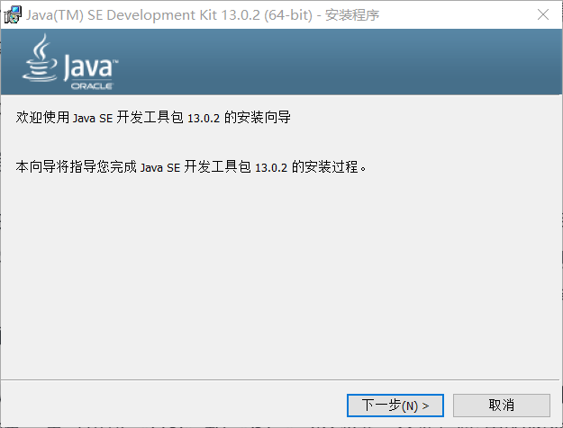

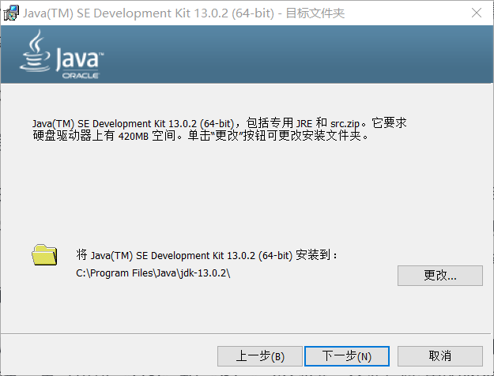

推荐您将 Java 安装到 C 盘，这里的默认安装路径不要修改。

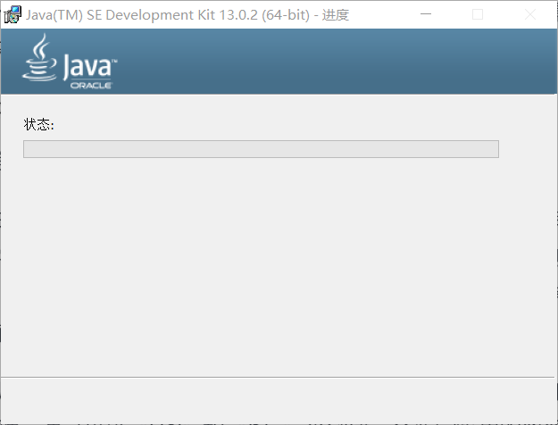

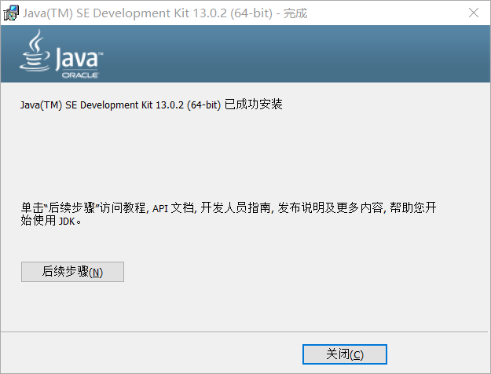

安装完毕后，需要在您的电脑上配置 Java 相关的环境变量。

配置 Java 环境变量的方式有两种。

#### 简单配置环境变量

以 windows10 系统为例，将安装路径的/bin 目录添加到此电脑右键->属性->高级系统设置->高级选项卡->环境变量->系统变量->Path 的第一项。放在第一项的原因是，如果一台电脑的环境变量中存在多个 JDK，会使用排列顺序在最前面的那一个。

比如：`C:\Program Files\Java\jdk-13.0.2\bin`

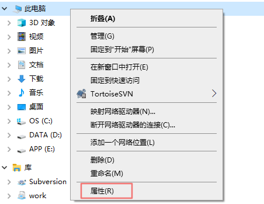

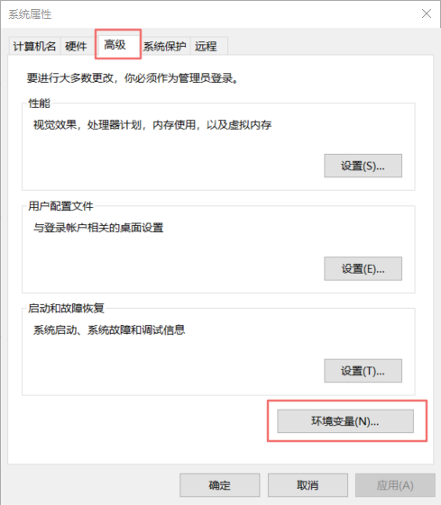

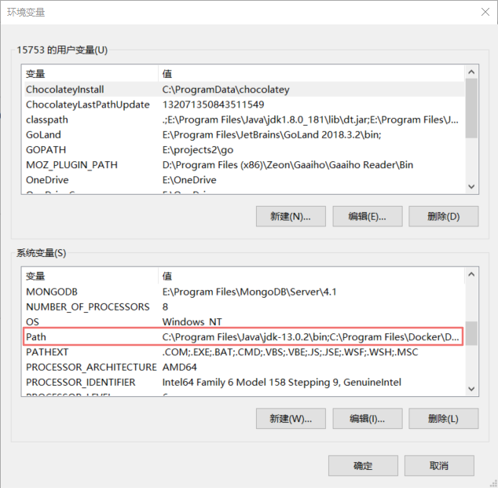

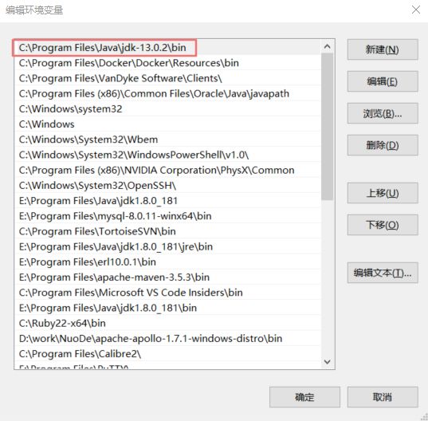

#### 传统方式配置环境变量

按照惯例，需要配置 3 个环境变量。

第一个需要配置的环境变量是 `JAVA_HOME`，它的值是 JDK 的安装路径，比如：`C:\Program Files\Java\jdk-13.0.2`。

第二个需要配置的环境变量是 `Path`，和简单方式的道理一样，只需要配置成 `JAVA_HOME/bin`。

第三个环境变量是`classpath`，配置内容是`.;%Java_Home%\bin;%Java_Home%\lib\dt.jar;%Java_Home%\lib\tools.jar`。

在 JDK1.5 版本后，不再需要配置`classpath`。原因是 jre 可以自动搜索目录下的类文件，并且可以加载 dt.jar 和 tool.jar。

这里推荐第二种方式配置。理由是在一些情况下这种配置更加方便。比如在同一台电脑上有多个 JDK、或者 Tomcat 等第三方软件的配置等。

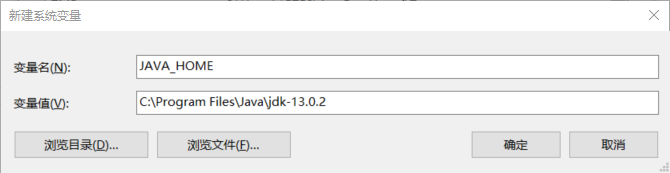

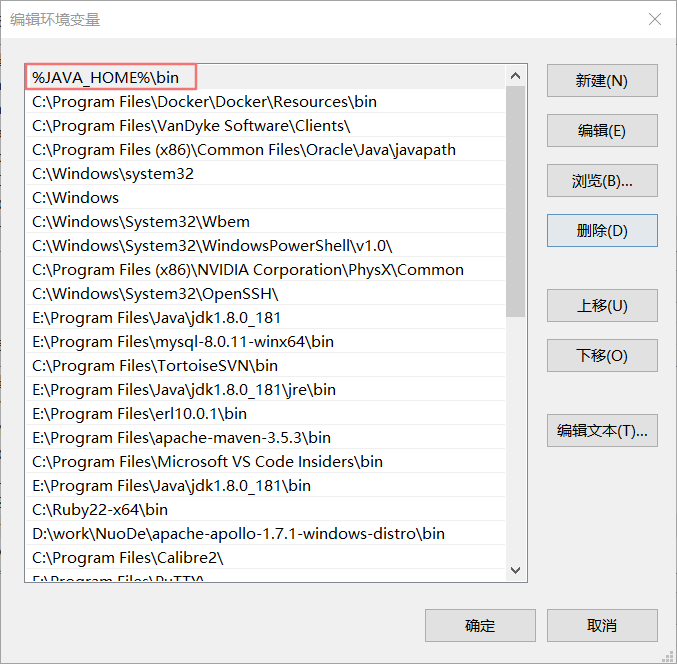

#### 检测 JDK 是否正常

无论您使用哪种方式配置环境变量，配置完成后，都可以在命令行中运行`java -version`和`javac -version`来测试配置是否正常。

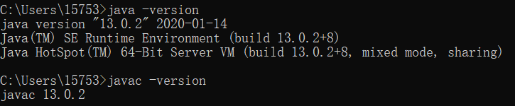

如果测试失败，就需要检查 JDK 安装和环境变量。
