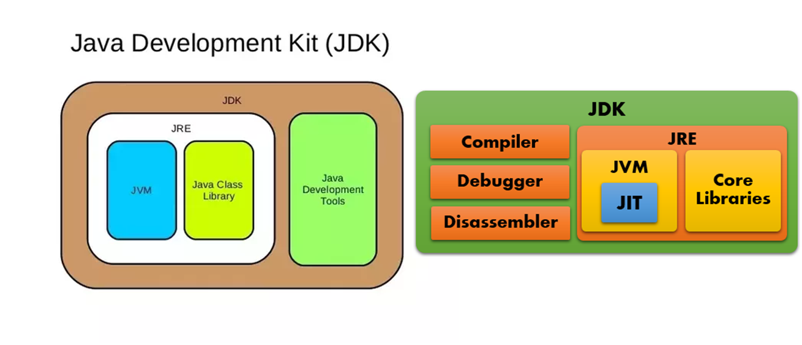

## Java 简介

### Java 分类

按照平台来分，Java 分三种平台。

- Java SE（Java Standard Edition） 用于桌面或简单服务器应用的 Java 平台。

- Java EE（Java Enterprise Edition） 用于企业级（复杂）应用的 Java 平台。

- Java ME（Java Micro Edition） 用于手机或嵌入式的 Java 平台。

JavaSE 是 Java 的标准版，平时大家最常使用的就是 JavaSE，本手札着重讲解的是 Java SE。

### 支撑 Java 运行的软件

- JDK（Java Development Kit）：Java 开发工具包，编写 Java 程序的开发包，一般是开发人员使用。

- JRE（Java Runtime Environment）：Java 运行时环境，运行 Java 程序的软件。

- JVM（Java Virtual Machine）：Java 虚拟机，将.java 文件转换为.class 文件，可以运行.class 文件。 Java 程序跨平台的核心。

三者的关系是，JDK 包含 JRE，JRE 包含 JVM。

如果您是一个开发者，建议您直接安装 JDK。

### Java 版本号

Java 最早的版本命名法是 1.x 的命名法。每次升级都是 1.1、1.2、1.3 这种增加小数点后面的数值。

在 1998 年 Sun 公司认为这样不能反映 JDK 的重大改进，将 Java 重命名为 Java2。

Java 的第 5 个版本，叫做 J2SE SDK 5.0。

在此之前的版本，命名规则是 Java1.0、1.1、1.2、1.3、1.4。

2006 年，版本号再次简化，变为 Java SE 6，Java SE 7 这种命名法。但是内部版本号是 1.6.0、1.7.0、1.8.0
